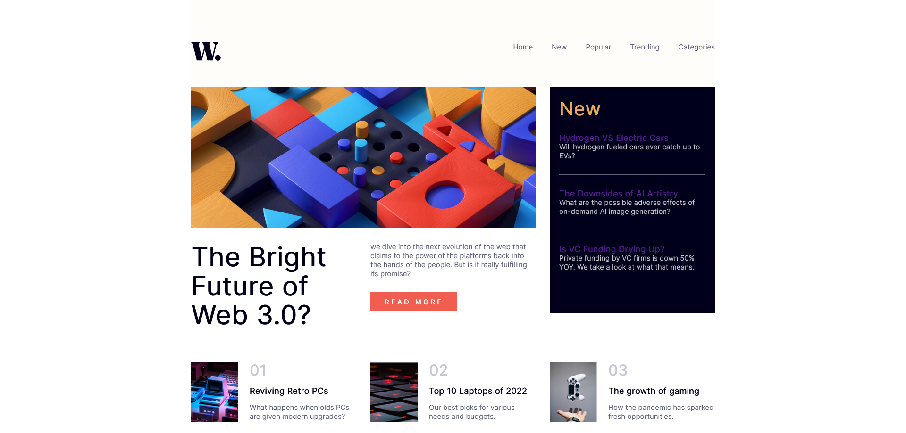
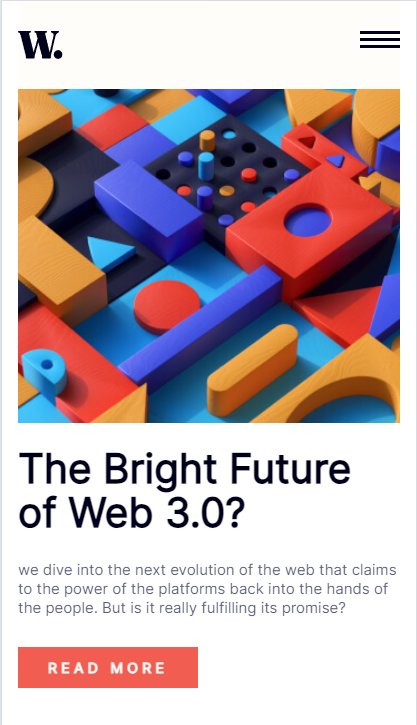

# Frontend Mentor - News homepage solution

This is a solution to the [News homepage challenge on Frontend Mentor](https://www.frontendmentor.io/challenges/news-homepage-H6SWTa1MFl). Frontend Mentor challenges help me improve your coding skills by building realistic projects. 

## Table of contents

- [Overview](#overview)
  - [The challenge](#the-challenge)
  - [Screenshots](#screenshots)
  - [Links](#links)
- [My process](#my-process)
  - [Built with](#built-with)
  - [What I learned](#what-i-learned)
  - [Continued development](#continued-development)
  - [Useful resources](#useful-resources)
- [Author](#author)
- [Acknowledgments](#acknowledgments)

## Overview

### The challenge

Users should be able to:

- View the optimal layout for the interface depending on their device's screen size
- See hover and focus states for all interactive elements on the page

### Screenshots

desktop view

mobile view

### Links

- Solution URL: [Responsive-news-homepage](https://github.com/DarekRepos/Responsive-news-homepage)
- Live Site URL: [live](https://darekrepos.github.io/Responsive-news-homepage/)

## My process

### Built with

- Semantic HTML5 markup
- CSS custom properties
- Flexbox
- CSS Grid
- Mobile-first workflow
- Vite
- BEM
- Sass
- use mobile first approach

### What I learned

I implemented a modern web design using a combination of cutting-edge techniques and best practices. Leveraging Semantic HTML5 markup, I ensured that the structure of the webpage was clear and accessible, prioritizing content hierarchy and user experience.

To style the elements, I utilized CSS custom properties, enabling easy maintenance and flexibility throughout the project. Employing Flexbox and CSS Grid allowed me to create dynamic layouts that adapt seamlessly to different screen sizes and devices, following a mobile-first workflow to ensure optimal performance on smaller screens.

Thanks to Vite, a lightning-fast build tool, I was able to streamline my development process, significantly reducing build times and enhancing productivity. Implementing the BEM (Block Element Modifier) methodology helped maintain a scalable and modular codebase, facilitating collaboration and future updates.

Additionally, I incorporated Sass for advanced CSS authoring, taking advantage of features like variables, mixins, and nesting to write cleaner and more maintainable stylesheets. Embracing a mobile-first approach throughout the project ensured that the website was optimized for mobile devices from the outset, delivering a seamless experience across all platforms.

Overall, this project not only allowed me to apply a diverse range of web development skills but also reinforced the importance of staying up-to-date with industry trends and best practices to deliver high-quality, responsive web solutions.

### Continued development

I'm proud to have achieved flexible and responsive layouts. Deploying the page to GitHub Pages presented the biggest challenge, but I learned a lot from troubleshooting the issues. Building the responsive menu was another hurdle, as it involved combining various HTML, CSS, and JavaScript elements. Moving forward, I'm eager to focus on accessibility, enhance my JavaScript skills, and explore Sass for more efficient styling.

### Useful resources

- MDN Web Docs - this help me mostly with html and javascript part like optimizing javascript and images. 

- Sass, Vite Documentation - it help me with issues like mixin and deploying

- Lighthouse and Performance Insights Tool in  Chrome - i use this tool to check performance and how my website behave on different screens (mobile, desktop, tablet)

- [CSS-Tricks](https://css-tricks.com/) - this help me a lot with best css practices like box-sizning css resetings etc.. I really liked this patterns and will use it going forward.

- [Can I Use](https://caniuse.com) - this is excellent website that help me check if some css like text-rendering support all browsers

- [Eyedropper](https://firefox-source-docs.mozilla.org/devtools-user/eyedropper/index.html) - eyedropper tool from firefox to grab css color

- [Figma](https://www.figma.com/) - Paste your design image to check the size of containers, width, etc.

- youtube canals @TheCoderCoder and @KevinPowell - it helps me find the easiest way to create this solution

## Author

- Website - [Darek](https://www.darek-duda.pl)
- Frontend Mentor - [@DarekRepos](https://www.frontendmentor.io/profile/DarekRepos)

## Acknowledgments

A big thank you to anyone who provides feedback and the youtube canal @TheCoderCoder.  It definitely helps me find new ways to code and discover easier solutions!
